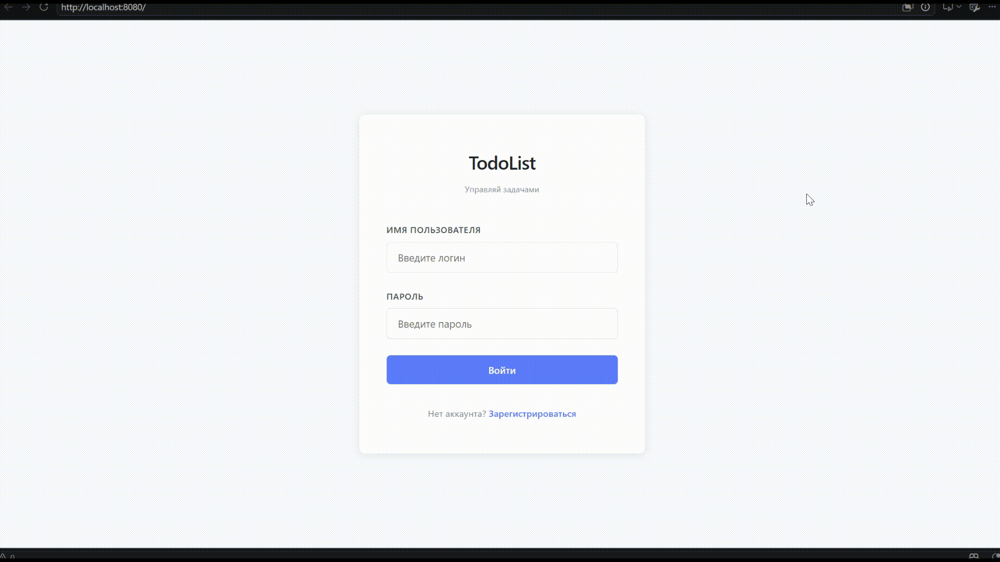
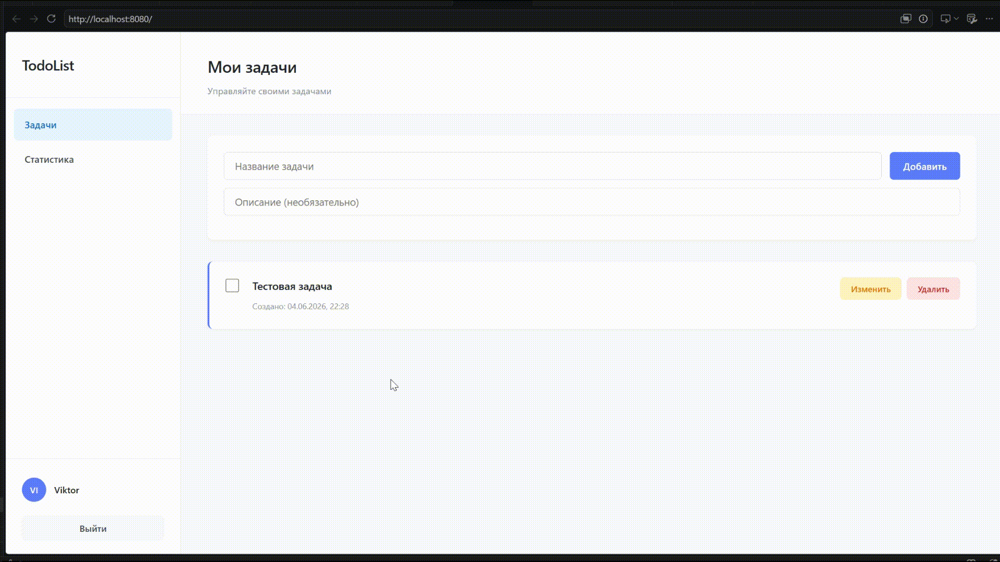
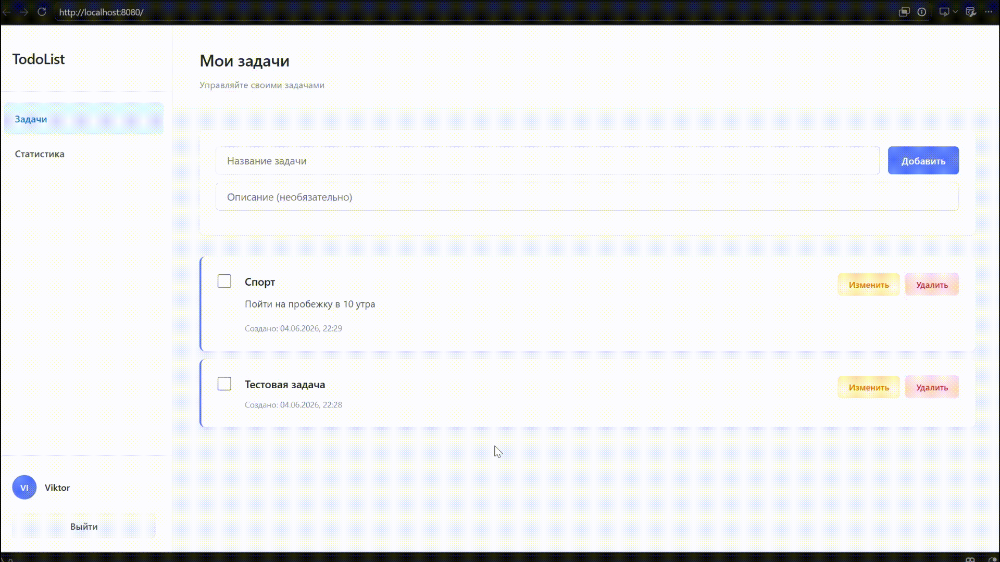
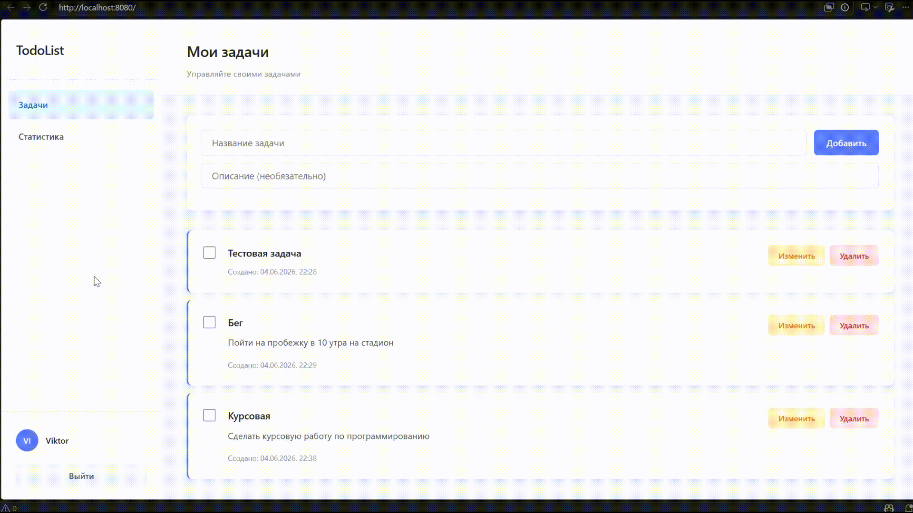
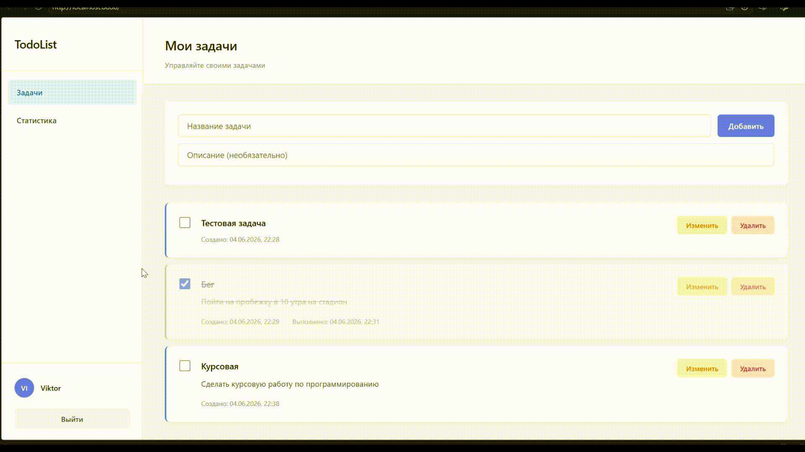

# REST API TODOLIST APPLICATION

Веб-приложение, реализованное по принципам REST API.

## Функционал

- Регистрация/аутентификация пользователя
- Создание/редактирование/удаление задач
- Статистика всех задач пользователя

## Технологический стэк

- **GOLANG** - backend
- **HTML** + **CSS** + **JS** - frontend
- **PostgreSQL** - хранение данных
- **Migrate** - инструмент для управления миграциями баз данных
- **Makefile** + **Docker** - сборка проекта 

## Установка и запуск

### Требования

- [go 1.25.5](https://go.dev/dl/)
- [Makefile 4.4.1](https://dev.to/sidneyops75/introduction-to-makefiles-for-go-developers-4fhb)
- [Migrate 4.19.1](https://github.com/golang-migrate/migrate)
- [Docker](https://www.docker.com/get-started/)

### Как запустить

1. **Создайте** переменные окружения в `.env` в корневой папке проекта:

```properties
POSTGRES_USER=some-username
POSTGRES_PASSWORD=some-password
POSTGRES_DB=some-db

POSTGRES_HOST=localhost
POSTGRES_PORT=5432

HTTP_ADDR=:8080

LOG_LEVEL=DEBUG
```

2. **Запустите**:

```bash
make env-up && \
make migrate-up && \
make app-run
```

3. **Откройте** в браузере ссылку http://localhost:8080/ или любую другую, указанную в `HTTP_ADDR`

## Демонстрация работы приложения

### Регистрация и аутентификацая пользователя



### Создание задачи



### Редактирование задачи



### Удаление задачи



### Статистика по задачам



#  Документация

- **[Архитектура проекта](architecture.md)** — структура, схема базы данных.
- **[API Reference](api.md)** — описание всех эндпоинтов, примеры запросов/ответов.
